# Reddit Social Graph Analysis

Uma startup de análise de mídias sociais deseja criar um novo produto que ofereça insights sobre o engajamento e as conexões entre usuários em uma plataforma. Este projeto é um protótipo funcional capaz de responder a perguntas complexas sobre interações de usuários, popularidade de conteúdo e comunidades de interesse.

**Dataset:** Pushshift Reddit — Abril 2019
**Stack:** Neo4j 5.26 + GDS 2.25 + Python 3.14

---

## Dataset

### Pushshift Reddit Dataset

O **Pushshift Reddit Dataset** é uma coleção abrangente de submissões e comentários do Reddit, coletados e disponibilizados publicamente pelo projeto Pushshift.

Os arquivos utilizados são uma **amostra** do dataset original, disponibilizada no Zenodo ([DOI: 10.5281/zenodo.3608135](https://doi.org/10.5281/zenodo.3608135)), referente ao mês de abril de 2019:

| Arquivo | Tamanho | Descrição |
|---|---|---|
| `RS_2019-04.zst` | 5,6 GB | Todas as submissões publicadas no Reddit durante abril de 2019 |
| `RC_2019-04.zst` | 15,5 GB | Todos os comentários publicados no Reddit durante abril de 2019 |

> Os arquivos estão comprimidos no formato `.zst` (Zstandard). Os links originais do Pushshift (`files.pushshift.io`) parecem não estar mais disponíveis.

Cada arquivo segue o formato **NDJSON** (*Newline Delimited JSON*), onde cada linha representa um objeto JSON independente contendo os dados de uma submissão ou comentário.

Os CSVs processados estão disponíveis no Kaggle [aqui](https://www.kaggle.com/datasets/jaymetosineto/the-pushshift-reddit-dataset-csv).

### Resultado da importação

| Label / Tipo | Total |
|---|---|
| :User | 6.562.881 |
| :Submission | 12.670.489 |
| :Subreddit | 197.870 |
| INTERACTED | 85.910.259 |
| POSTED | 12.670.489 |
| BELONGS_TO | 12.670.489 |
| ACTIVE_IN | 5.838.288 |

---

## Modelo do Grafo

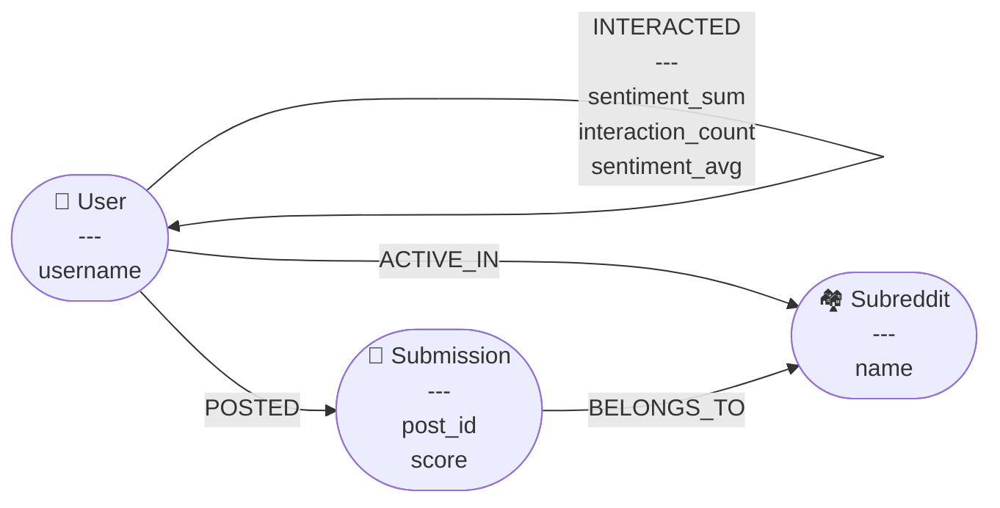

---

## Estrutura do Projeto

```
social_analysis/
├── scripts/
│   ├── neo4j_base.py               # Conexão, helpers, projeções GDS
│   ├── prepare_data_01.py          # Pré-processamento dos arquivos brutos
│   ├── prepare_data_02.py          # Refinamento e filtragem dos dados
│   ├── prepare_data_03.py          # Conversão para formato neo4j-admin
│   ├── prepare_data_04.py          # Índices e constraints no Neo4j
│   ├── analysis_04_bots.py         # Detecção de bots (executar primeiro)
│   ├── analysis_01_engagement.py   # Engajamento e influência
│   ├── analysis_02_content.py      # Qualidade de conteúdo
│   └── analysis_03_communities.py  # Comunidades e sobreposição
├── output/
│   ├── charts/                     # Gráficos gerados
│   └── _analysis_state.json        # Controle de execução (checkpoints)
├── prepare_data.sh                 # Script de preparação completa
├── run_analysis.sh                 # Script de execução das análises
└── requirements.txt
```

---

## Como Executar

```bash
# Criar ambiente virtual e instalar dependências
python -m venv .venv
source .venv/bin/activate
pip install -r requirements.txt

# Preparar e importar os dados
bash prepare_data.sh

# Criar índices no Neo4j (Neo4j Desktop deve estar rodando)
python scripts/prepare_data_04.py

# Executar análises
bash run_analysis.sh
```

Para reexecutar uma análise do zero, remova a etapa correspondente do arquivo `output/_analysis_state.json` ou apague o arquivo inteiro.

---

## Pipeline de Preparação dos Dados

### `prepare_data_01.py` — Pré-processamento

Transforma os arquivos brutos do Pushshift em CSVs limpos e prontos para importação no Neo4j.

**Arquivos de entrada:** `RC_2019-04.zst`, `RS_2019-04.zst`

**Arquivos de saída:**

| Arquivo | Descrição |
|---|---|
| `users.csv` | Usuários únicos encontrados no dataset |
| `submissions.csv` | Posts com `post_id`, `author`, `subreddit` e `score` |
| `user_relations.csv` | Relações entre usuários com `sentiment_sum` e `interaction_count` |

**Etapas:**

**0. Contagem de linhas** — conta o total de linhas de cada `.zst` para exibir progresso percentual. Resultado cacheado em `_line_counts.json`.

**1. Indexação das submissions** — lê o `RS`, filtra autores deletados/bots e indexa cada `post_id → author` num banco SQLite local, gerando também o `submissions.csv`.

**2. Indexação dos comentários** — primeira passagem no `RC`, indexando `comment_id → author` no SQLite. Necessário para resolver respostas a outros comentários.

**3. Análise de sentimento** — segunda passagem no `RC`. O texto de cada comentário é processado em lotes por um pool de workers paralelos que executam o VADER e retornam o `compound score` (-1.0 a +1.0). O processo principal resolve o autor do `parent_id` via SQLite e acumula a soma dos scores por par `(author → target_author)`.

**4 e 5. Exportação** — gera `user_relations.csv` com sentimento agregado e `users.csv` com todos os usuários únicos.

| Constante | Descrição |
|---|---|
| `KEEP_DB` | `True` mantém o `_index.db` após o processamento (padrão) |
| `NUM_WORKERS` | Calculado automaticamente: cores físicos menos 2 (se > 4) |
| `READ_BUFFER` | Tamanho do buffer de leitura, escala com o número de workers |
| `IGNORED_AUTHORS` | Autores filtrados: `[deleted]`, `[removed]`, `AutoModerator` |

> Os arquivos `.zst` são lidos como streams linha a linha, sem carregar o conteúdo inteiro na memória. O processamento pode levar várias horas dado o volume do arquivo de comentários (15,5 GB comprimido).

### `prepare_data_02.py` — Refinamento

Opera em 4 etapas sequenciais em streaming. O progresso é salvo em `_clean_state.json` após cada etapa.

**1. Cálculo do threshold** — calcula o percentil 5 dos valores de `interaction_count` de todas as relações válidas. Esse valor vira o threshold mínimo para a etapa seguinte.

**2. Filtragem de relações** — remove auto-relações e relações com `interaction_count` abaixo do threshold.

**3. Filtragem de submissions** — remove posts cujo autor não consta entre os autores válidos.

**4. Filtragem de usuários** — remove usuários sem relações nem submissions, garantindo que o grafo não contenha nós isolados.

Cada etapa escreve os resultados em `.tmp` antes de substituir o original. Se interrompido, o arquivo original permanece intacto.

### `prepare_data_03.py` — Conversão para Neo4j

Prepara os CSVs no formato esperado pelo `neo4j-admin import` e gera o script de importação. Todo o processamento é feito em streaming e o progresso é salvo em `_neo4j_state.json`.

```bash
# 1. Gera os CSVs no formato neo4j-admin
python scripts/prepare_data_03.py

# 2. Copia os CSVs para o diretório de import do Neo4j
cp dataset/neo4j_import/*.csv ~/neo4j-data/import/

# 3. Executa o bulk import (Neo4j deve estar parado)
bash import_command.sh

# 4. Sobe o Neo4j
bash neo4j-docker.sh
```

### `prepare_data_04.py` — Índices e Constraints

Com 6,5M de nós User, 12,6M de Submissions e 85,9M de arestas INTERACTED, queries sem índice resultam em full scans. Este script deve ser executado uma única vez após a importação.

**Constraints** (unicidade + índice implícito):

| Label | Propriedade |
|---|---|
| User | username |
| Subreddit | name |
| Submission | post_id |

**Índices RANGE:**

| Label | Propriedade | Uso |
|---|---|---|
| User | community | Queries de comunidade após o Louvain |
| User | bot_suspect | Filtro de suspeitos de bot |
| Submission | score | Distribuição e filtros de score |
| INTERACTED | sentiment_avg, interaction_count, sentiment_sum | Queries de análise |

---

## Resultados

### Análise 4 — Detecção de Bots

Executada antes das demais análises para evitar distorções nos resultados.

**Critérios de suspeição:**
- **Volume:** usuários com mais de **417 interações enviadas** (threshold IQR×3)
- **Sentimento neutro:** sentimento médio entre -0,05 e +0,05 com mínimo de 50 interações
- **Ratio:** alta proporção de alvos únicos em relação ao volume total

A distribuição de volume é extremamente concentrada próxima de zero, com cauda longa de suspeitos claramente separada do comportamento normal. O scatter plot de sentimento mostra concentração densa de suspeitos em baixo volume, com alguns outliers de alto volume e sentimento próximo de zero — padrão típico de bots que respondem de forma padronizada.

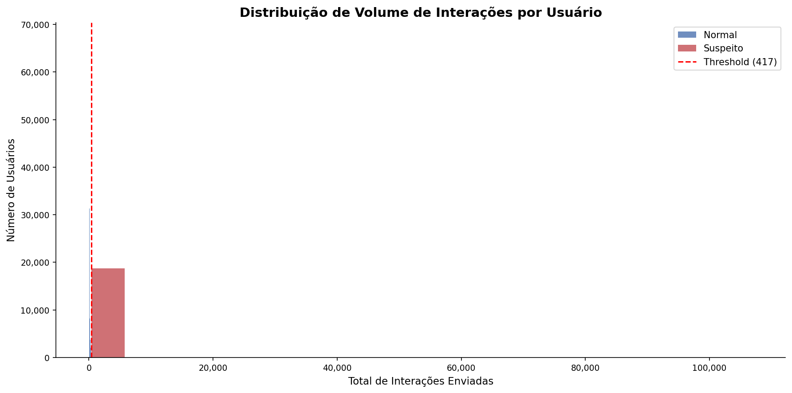
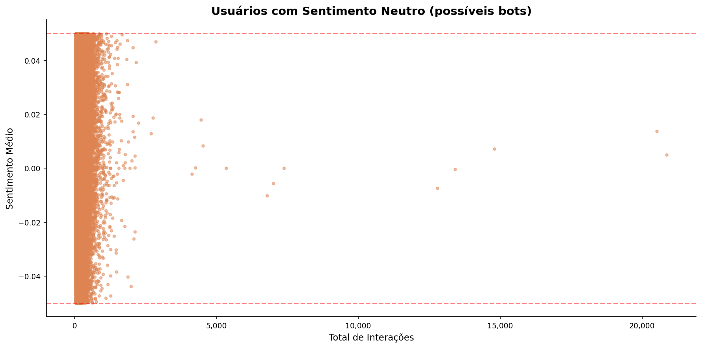

---

### Análise 1 — Engajamento

#### Distribuição de Score dos Posts

A distribuição segue uma lei de potência característica de redes sociais. A faixa 1–5 concentra a maior parte dos posts (~6,7M), com queda abrupta em faixas superiores. Posts acima de 1.000 pontos representam menos de 2% do total, confirmando que conteúdo viral é raro e concentrado em poucos autores e subreddits.

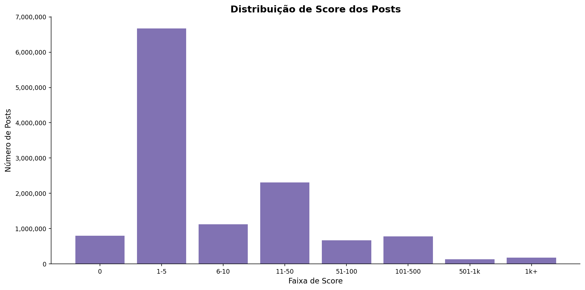

#### Top Subreddits por Número de Posts

O r/AskReddit lidera com quase 300.000 posts, seguido por r/dankmemes (~165k) e r/AutoNewspaper (~155k). A presença de r/AutoNewspaper, r/newsbotbot e r/AlbumCN no top 10 é um indicativo claro de atividade automatizada — confirmado pela análise de bots.

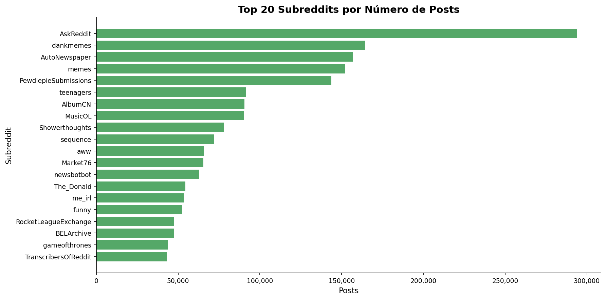

#### Top Subreddits por Usuários Ativos

O r/AskReddit destaca-se com ~138k usuários ativos únicos, quase o dobro do segundo colocado (r/PewdiepieSubmissions, ~63k). Os subreddits de entretenimento e memes dominam o ranking, com forte presença de comunidades de jogos (FortNiteBR, gameofthrones, apexlegends).

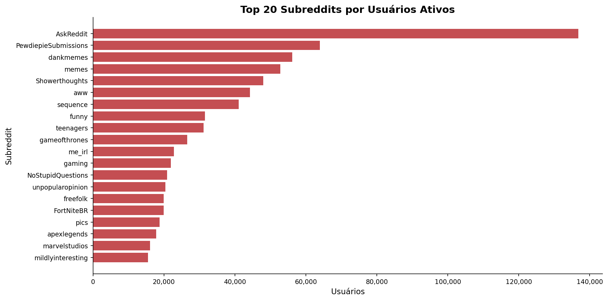

#### Top Subreddits por Volume de Interações

O r/TranscribersOfReddit aparece com volume de interações ordens de magnitude acima de qualquer outro subreddit (~1,65 bilhão), o que é anômalo e aponta para comportamento automatizado ou mecânica específica da comunidade. r/newsbotbot e r/hockey aparecem na sequência com volumes muito menores (~200M e ~100M).

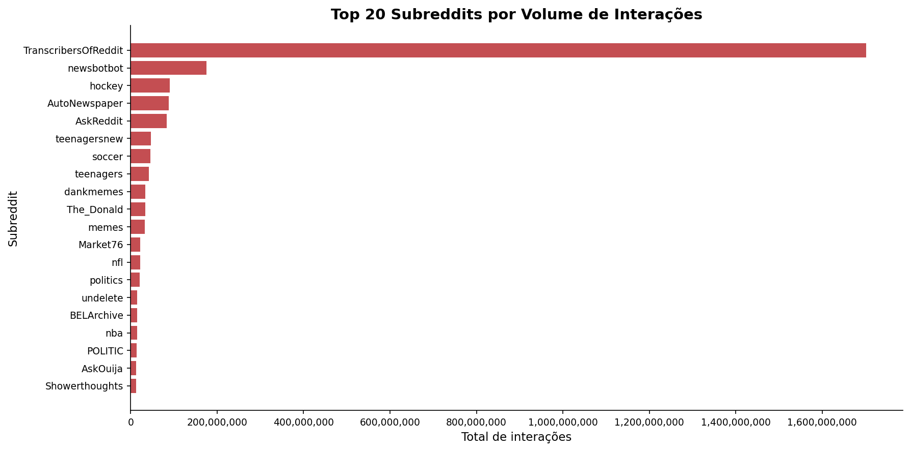

#### Top Usuários por Interações Enviadas e Recebidas

Entre os maiores emissores, praticamente todos os nomes do top 20 são bots declarados (KeepingDankMemesDank, MemeInvestor_bot, Marketron-I, MTGCardFetcher). Entre os maiores receptores, destacam-se usuários humanos como OPINION_IS_UNPOPULAR, to_the_tenth_power e agrandthing.

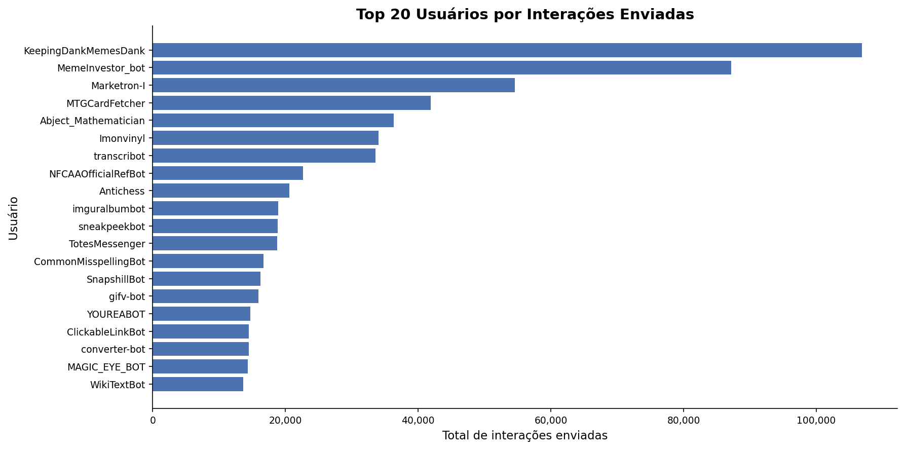
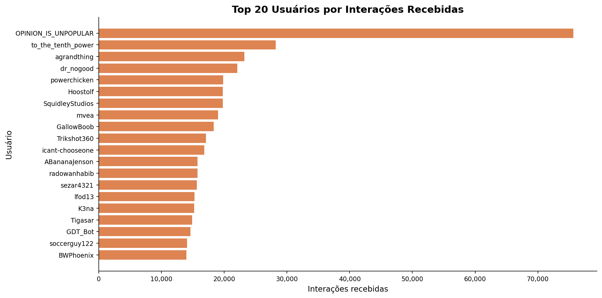

#### Top Usuários por Influência (PageRank)

O PageRank ponderado pelo volume de interações revelou OPINION_IS_UNPOPULAR como o usuário mais influente da rede por ampla margem (score ~6.300), seguido por MemeInvestor_bot (~3.600) e GDT_Bot (~3.000). A mistura de humanos altamente engajados com bots de alta conectividade reflete a natureza híbrida das redes sociais modernas.

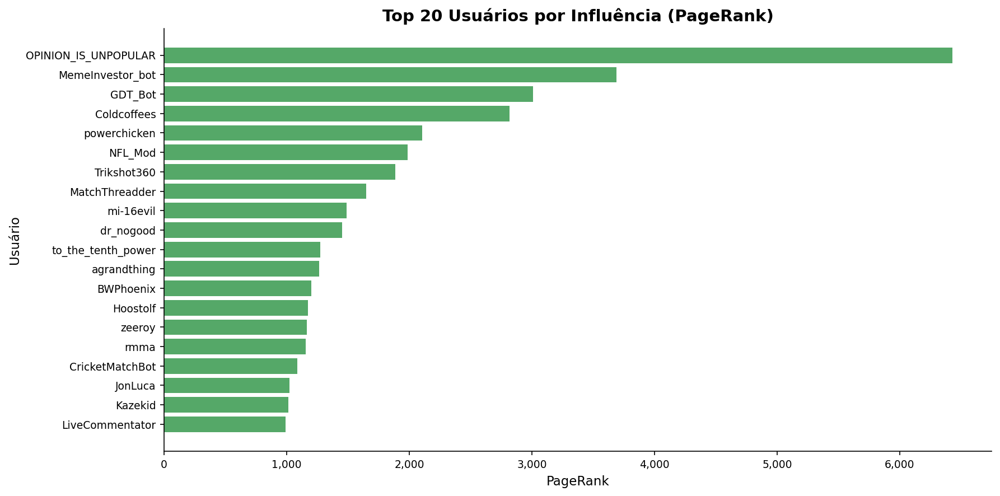

---

### Análise 2 — Qualidade de Conteúdo

#### Top Posts por Score

O post de maior score (~206k pontos) foi publicado no r/pics pelo usuário iKojan, seguido por um post de r/science com ~153k. Os posts mais votados concentram-se em subreddits de conteúdo visual e emocional (pics, gifs, aww, funny), com alguma presença de r/science e r/gaming.

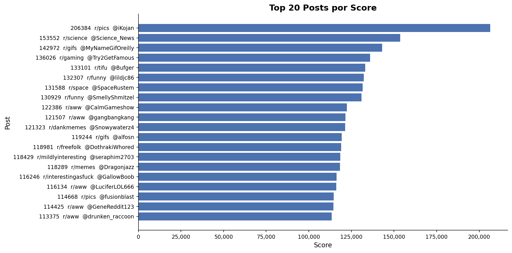

#### Top Subreddits por Score Médio por Post

Os subreddits com maior score médio são predominantemente de GIFs e humor visual: r/GifRecipes lidera com média ~3.700, seguido por r/holdmyredbull (~3.000) e r/instant_regret (~2.950). Conteúdo curto, visual e com componente emocional forte gera engajamento desproporcional em relação ao volume de posts.

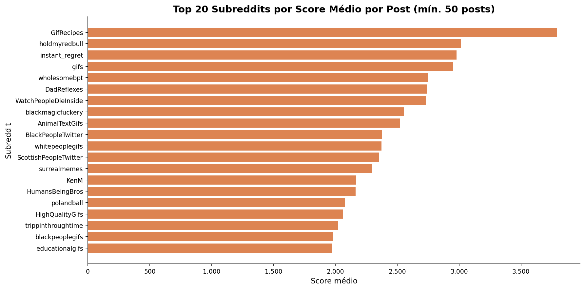

---

### Análise 3 — Comunidades

#### Detecção de Comunidades (Louvain)

O algoritmo de Louvain identificou comunidades bem definidas na rede de interações. As 4 maiores têm 1,2M, 800k, 650k e 460k usuários respectivamente — tamanhos compatíveis com os grandes hubs generalistas. As comunidades menores são mais temáticas e coesas.

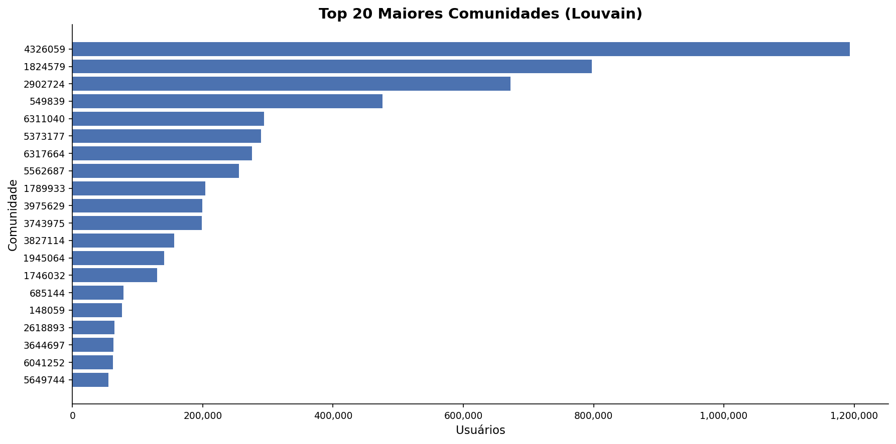

#### Subreddit Dominante por Comunidade

Cada comunidade possui um subreddit temático central claramente identificável. As maiores são dominadas por r/AskReddit e r/dankmemes, enquanto comunidades menores têm identidades muito específicas: FortNiteBR, thedivision, freefolk, MortalKombat, gonewild, The_Donald, leagueoflegends, FashionReps, nba, FIFA e Warhammer40k — demonstrando que o grafo de interações captura agrupamentos temáticos reais.

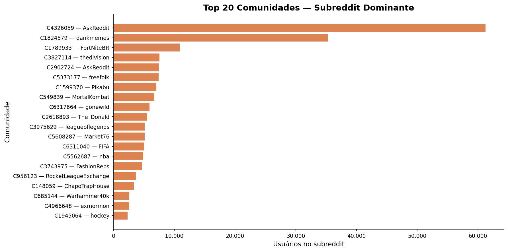

#### Sobreposição de Audiência entre Subreddits

O par com maior sobreposição é r/dankmemes ↔ r/memes (~13k usuários em comum), seguido por r/AskReddit ↔ r/Showerthoughts (~11,5k) e r/dankmemes ↔ r/PewdiepieSubmissions (~8,5k). A presença do r/AskReddit em praticamente todo o ranking confirma seu papel como subreddit generalista e porta de entrada para a plataforma.

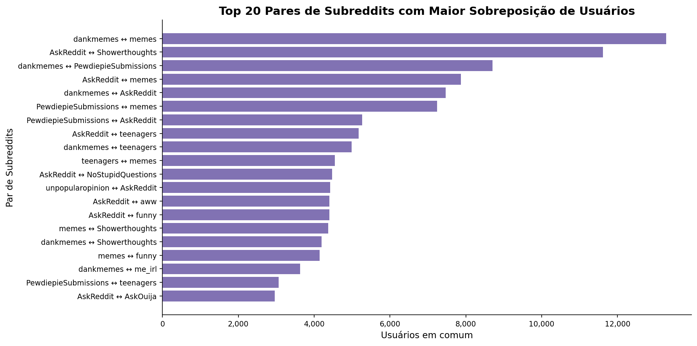

#### Usuários Ativos em Mais Subreddits

O usuário ingilizcecumleceviri é ativo em ~790 subreddits distintos, seguido por Kinglens311 (~580) e elstoni19 (~555). A distribuição geral mostra que a grande maioria dos usuários é ativa em poucos subreddits — comportamento típico de lei de potência.

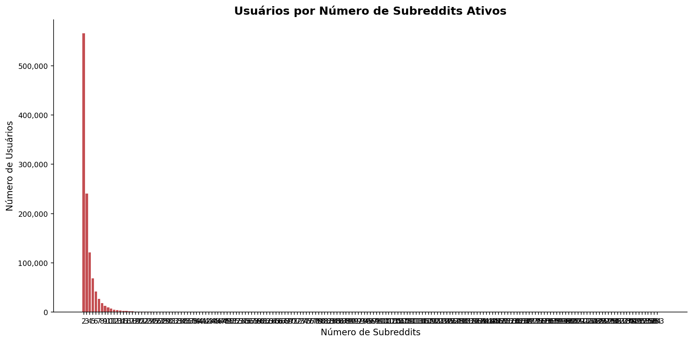

---

## Conclusões

**Estrutura da rede:** O grafo do Reddit em abril de 2019 apresenta estrutura típica de redes livres de escala, com poucos hubs de altíssimo engajamento (AskReddit, dankmemes) e uma longa cauda de comunidades menores e temáticas. A detecção de comunidades via Louvain reflete agrupamentos temáticos reais e coerentes com o conhecimento externo sobre esses subreddits.

**Bots e automação:** A presença de bots é significativa e estruturante na rede. Bots como MemeInvestor_bot, GDT_Bot e KeepingDankMemesDank figuram entre os usuários de maior volume e PageRank. Subreddits como r/TranscribersOfReddit e r/newsbotbot apresentam volumes de interação anômalos que distorcem qualquer análise de engajamento se não tratados.

**Qualidade do conteúdo:** O conteúdo de maior score não vem dos subreddits com mais posts, mas de comunidades menores e altamente selecionadas (GifRecipes, holdmyredbull, instant_regret). A distribuição de score segue lei de potência, com a grande maioria dos posts recebendo menos de 10 pontos.

**Comportamento cross-community:** A maioria dos usuários é ativa em poucos subreddits, mas um grupo pequeno de "super-connectors" navega por centenas de comunidades simultaneamente — papel relevante para a propagação de conteúdo entre comunidades distintas.

---

## Stack Técnica

| Componente | Versão |
|---|---|
| Neo4j | 5.26 |
| Neo4j GDS | 2.25.0 |
| Python | 3.14 |
| pandas | 3.x |
| matplotlib | 3.x |
| neo4j (driver) | 6.x |
| VADER Sentiment | 3.3.2 |
| zstandard | 0.25.x |
